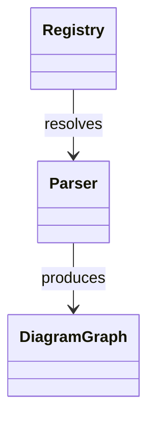

# diagramr

Generate Mermaid class diagrams from source code. Point it at a Go repository and get a diagram showing your structs, interfaces, and relationships.

```
diagramr generate ./internal
```



---

## Install

**Go install**
```sh
go install github.com/melekabbassi/diagramr/cmd/diagramr@latest
```

**From source**
```sh
git clone https://github.com/melekabbassi/diagramr
cd diagramr
go build -o diagramr ./cmd/diagramr
```

---

## Quickstart

```sh
# 1. Create a config file in your project
diagramr init

# 2. Validate the config
diagramr validate

# 3. Generate a diagram
diagramr generate ./...
```

The `init` command writes a `diagramr.config.yaml` with sensible defaults. The `generate` command walks the source tree, extracts types and relationships, and outputs a Mermaid class diagram.

---

## Commands

| Command | Description |
|---------|-------------|
| `diagramr init` | Create a `diagramr.config.yaml` in the current directory |
| `diagramr validate` | Load and validate config, print a summary |
| `diagramr generate [path]` | Generate a diagram from source at the given path |
| `diagramr version` | Print the version |

---

## Configuration

`diagramr init` creates this file:

```yaml
# diagramr.config.yaml
language: auto       # auto, go, ts
format: mermaid      # mermaid, json, svg, png
max_nodes: 200       # cap nodes to keep diagrams readable
```

All fields can also be set via environment variables with the `DIAGRAMR_` prefix:

```sh
DIAGRAMR_FORMAT=json DIAGRAMR_MAX_NODES=50 diagramr generate ./...
```

Precedence: **flags > env vars > config file > defaults**

---

## What gets extracted

For Go sources, diagramr uses the standard `go/ast` package to extract:

- **Structs** and **interfaces** as nodes
- **Fields** and **methods** with visibility (exported vs unexported)
- **Relationships** as edges:

| Relation | Meaning |
|----------|---------|
| `embeds` | Anonymous struct embedding |
| `implements` | Struct satisfies interface (structural, inferred) |
| `uses` | Struct has a field of another type |
| `imports` | Package-level import |

Private fields and methods are excluded by default.

---

## Output formats

| Format | Status |
|--------|--------|
| `mermaid` | Mermaid class diagram syntax |
| `json` | Raw graph IR (nodes + edges) |
| `svg` | SVG image via `mmdc` |
| `png` | PNG image via `mmdc` |

SVG and PNG output require the [Mermaid CLI](https://github.com/mermaid-js/mermaid-cli):

```sh
npm install -g @mermaid-js/mermaid-cli
```

---

## Development

```sh
# Run tests
go test ./... -race

# Lint
go vet ./...

# Build
go build ./...
```

Tests use fixture packages in `testdata/go/` — small self-contained packages that exercise specific parsing scenarios (simple structs, embedding, interfaces, multi-file packages).

CI runs on Linux, macOS, and Windows via GitHub Actions.

---

## Roadmap

- [x] Go AST parser (structs, interfaces, methods, fields, relationships)
- [x] Mermaid class diagram renderer
- [x] CLI commands (`init`, `validate`, `generate`, `version`)
- [x] Config file + env var support
- [ ] Wire `generate` end-to-end (parser → renderer → output)
- [ ] JSON / SVG / PNG output backends
- [ ] Watch mode (`--watch`)
- [ ] TypeScript parser
- [ ] Neovim plugin

---

## License

MIT
