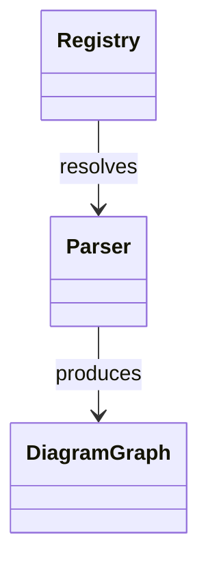

# diagramr

Generate Mermaid class diagrams from source code. Point it at a Go repository and get an interactive diagram showing your structs, interfaces, and relationships.

```
diagramr generate ./internal
```



---

## Install

**Go install**
```sh
go install github.com/melekabbassi/diagramr/cmd/diagramr@latest
```

**From source**
```sh
git clone https://github.com/melekabbassi/diagramr
cd diagramr
go build -o diagramr ./cmd/diagramr
```

---

## Quickstart

```sh
# 1. Create a config file in your project
diagramr init

# 2. Generate a diagram — opens diagramr studio in the browser
diagramr generate ./...

# Skip the browser and print Mermaid source to stdout
diagramr generate --no-open ./...
```

---

## diagramr studio

Running `generate` opens a local web UI automatically:

- **Pan & zoom** — scroll to zoom, drag to pan
- **Live editor** — edit Mermaid source directly; diagram updates as you type
- **Live reload** — diagram re-renders whenever a `.go` file in the target directory changes
- **Export** — download PNG or SVG, or copy the image / Mermaid source to clipboard
- **Controls** — direction (TB / LR / RL / BT), theme (default / dark / forest / neutral), toggle methods / fields / private members
- **Save** — writes the current Mermaid source back to `diagramr.mmd` in the project root

The studio URL is printed to the terminal as a fallback if the browser window is closed.

---

## Commands

| Command | Description |
|---------|-------------|
| `diagramr init` | Create a `diagramr.config.yaml` in the current directory |
| `diagramr validate` | Load and validate config, print a summary |
| `diagramr generate [path]` | Generate a diagram and open diagramr studio |
| `diagramr version` | Print the version |

### generate flags

| Flag | Default | Description |
|------|---------|-------------|
| `--lang` | `auto` | Source language (`auto`, `go`) |
| `--format` | `mermaid` | Output format (`mermaid`, `json`) |
| `--output`, `-o` | — | Write output to file instead of the studio |
| `--no-open` | `false` | Skip the browser; print to stdout |
| `--include-private` | `false` | Include unexported types and members |
| `--max-nodes` | config | Cap the number of nodes in the diagram |

---

## Configuration

`diagramr init` creates this file:

```yaml
# diagramr.config.yaml
language: auto       # auto, go
format: mermaid      # mermaid, json
max_nodes: 200       # cap nodes to keep diagrams readable
```

All fields can also be set via environment variables with the `DIAGRAMR_` prefix:

```sh
DIAGRAMR_FORMAT=json DIAGRAMR_MAX_NODES=50 diagramr generate ./...
```

Precedence: **flags > env vars > config file > defaults**

---

## What gets extracted

For Go sources, diagramr uses the standard `go/ast` package to extract:

- **Structs** and **interfaces** as nodes
- **Fields** and **methods** with visibility (exported vs unexported)
- **Relationships** as edges:

| Relation | Meaning |
|----------|---------|
| `embeds` | Anonymous struct embedding |
| `implements` | Struct satisfies interface (structural, inferred) |
| `uses` | Struct has a field of another type |

Private fields and methods are excluded by default; pass `--include-private` to include them.

---

## Output formats

| Format | How |
|--------|-----|
| `mermaid` | Mermaid class diagram syntax (default) |
| `json` | Raw graph IR (nodes + edges) |
| PNG / SVG | Export from diagramr studio (browser UI) |

---

## Development

```sh
# Run tests
go test ./... -race

# Lint
go vet ./...

# Build
go build ./...
```

Tests use fixture packages in `testdata/go/` — small self-contained packages that exercise specific parsing scenarios (simple structs, embedding, interfaces, multi-file packages).

CI runs on Linux, macOS, and Windows via GitHub Actions.

---

## Roadmap

- [x] Go AST parser (structs, interfaces, methods, fields, relationships)
- [x] Mermaid class diagram renderer
- [x] CLI commands (`init`, `validate`, `generate`, `version`)
- [x] Config file + env var support
- [x] diagramr studio (interactive browser UI with pan/zoom, editor, export, live reload)
- [ ] JSON / SVG / PNG CLI output backends
- [ ] TypeScript parser
- [ ] Neovim plugin

---

## License

MIT
